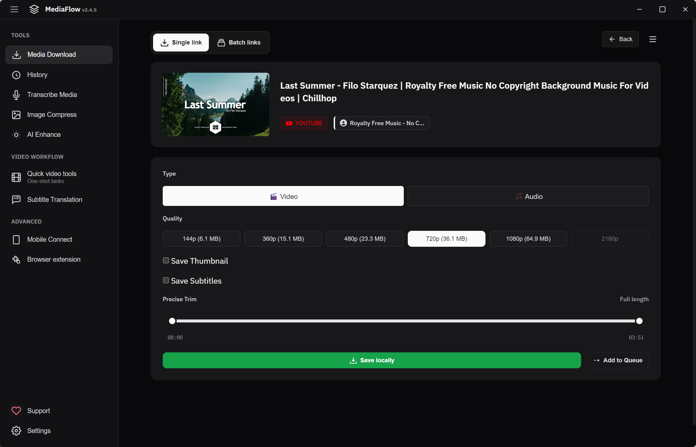

# MediaFlow

<p align="center">
  
</p>

<h1 align="center">MediaFlow — Free Video Downloader & Media Toolkit</h1>

<p align="center">An open-source desktop media toolkit for downloading videos (YouTube, TikTok, Bilibili, Douyin and more), processing, transcribing, enhancing, and creating with media.</p>

<p align="center"><a href="https://mediaflowing.com/">Visit the official website</a></p>

<p align="center">
  <a href="LICENSE"></a>
  
</p>

MediaFlow is a free desktop application built with Electron. It brings common media workflows into one local workspace, with no paid edition, activation key, or feature lock.

## Features

- Download videos and audio from supported platforms through yt-dlp
- Batch, playlist, and queued downloads
- Local speech-to-text and AI-assisted text polishing
- Image and video enhancement with Real-ESRGAN and Real-CUGAN
- Video utilities including trimming, speed changes, frame capture, GIF export, vertical-video tools, and watermarking
- Multi-track editing
- Subtitle translation, text-to-speech, and dubbing workflows
- LAN/mobile transfer and QR-code sharing
- Image compression and format conversion

## Screenshots

<p align="center">
  
</p>

<p align="center">
  
</p>

> The media shown in these screenshots is used for interface demonstration only. Any third-party media remains subject to the rights and license terms of its respective creators and platforms.

## Development

### Requirements

- Node.js 20 or newer
- npm
- Windows is the primary supported desktop platform; macOS and Linux development builds are also supported

### Run locally

```bash
npm install
npm run bin:download
npm run dev
```

The binary download step retrieves the local media engines used by the application. Those downloaded binaries are intentionally excluded from this repository.

### Test, lint, and build

```bash
npm run test:ci
npm run lint
npm run build:win
```

## Repository scope

This repository contains the open-source MediaFlow desktop application only.

The official website and the optional browser extension are separate proprietary components. Their source code is not included here and is not covered by this repository's MIT license. The desktop app may include integration points for those services, but those integrations do not make the private components open source.

## Third-party components

- [yt-dlp](https://github.com/yt-dlp/yt-dlp) — Unlicense
- [FFmpeg](https://ffmpeg.org/) — LGPL 2.1
- Other dependencies retain their respective licenses; see the dependency metadata and project notices.

## Contributing

Issues and pull requests are welcome. Please do not include cookies, private credentials, access tokens, signing keys, downloaded binaries, personal media, or production logs in an issue or pull request.

## Links

- [Official website](https://mediaflowing.com/)
- [Source code](https://github.com/DavidNovainte/MediaFlow)

## License

MediaFlow is released under the [MIT License](LICENSE).

The software is provided without warranty. Use it responsibly and comply with the terms of service and copyright laws that apply to the content and platforms you use.
